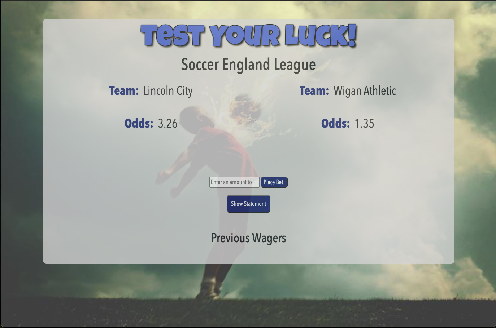

# :soccer: Test_Your-Luck :soccer:

## Description

This application is for all the sports betters lovers out there. This application will allow you to place bets between two teams using an API which will be stored in the database as well as each team, bet amount, and new amount. This database will be submitted to the database once `Place Bet!` button is clicked which will stay on the page but then disappear. To display previous wagers, you must press the `Show Statement` button and a table will be displayed below. 

:round_pushpin: [Click here to navigate to deployed app on Heroku!](https://test-your-luck.herokuapp.com/) :round_pushpin:

## Table of Contents

- [Demonstration](#demonstration)
- [Features](#features)
- [Installation](#installation)
- [Usage](#usage)
- [License](#license)
- [Collaboration](#collaboration)
- [Technologies](#technologies)
- [Resources](#resources)

## Demonstration
### Table View

### Main 

## Features

- Shows two teams depending on league chosen in the API (in this case, Soccer England League).
- Place a bet depending on the odds displayed.
- Pull from MySQL database and show previous bets placed.
- Use of a calculator to calculate possible winnings.

### Directory Structure

## Installation

The following dependencies are required to be installed for this application to run properly:

      npm i
      npm install axios
      npm install dotenv
      npm install express
      npm install express-handlebars
      npm install mysql
      npm install mysql2
      npm install sequelize
      npm install sequelize-cli

## Usage

Once all dependencies have been installed, users should run the following command in the terminal:

     `node server.js`

This command and will instruct the app to begin listening on the `LocalHost: PORT`. This will then instruct users to either `Cmd + Click` for Mac users or `Ctrl + Click` on Windows which will open the browser with the following address or to enter the following in the web browser to deploy the application locally.

    `localhost:8080`.

A deployed link is provided for this specific project through Heroku.

## License

This application is licensed under the MIT License.

## Collaboration

This project was creating with collaboration from:

- [Jerquanus Swan](https://github.com/Jerquanus)
- [Austin Cochran](https://github.com/Austinc12)
- [Cam Lundy](https://github.com/lundyc0917)
- [Nicole Catapano](https://github.com/nsc9605)

## Technologies

- [Axios](https://npmjs.org/package/axios)
- [Node.js](https://nodejs.org/en/)
- [Express.js](https://expressjs.com/)
- [Express Handlebars](https://www.npmjs.com/package/express-handlebars)
- [MySQL](https://dev.mysql.com/)
- [MySQL Workbench](https://dev.mysql.com/downloads/workbench/)
- [Dotenv](https://www.npmjs.com/package/dotenv)
- [Heroku](https://devcenter.heroku.com/articles/getting-started-with-nodejs)
- [Visual Studio Code](https://code.visualstudio.com/)
- Terminal / Git Bash

## Resources

- [Odds API](https://github.com/the-odds-api)
